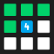
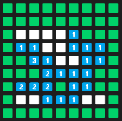
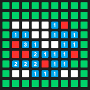
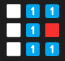

# How to solve Minesweeper:

We need to think of an algorithm that will flag spaces that it knows are bombs, and middle click spaces that have no un-flagged bomb neighbors. I developed the algoritm well be using for this project, but I acknowledge that others might've come up with the same idea independantly.

## Step 1: Flagging
We need to flag any square that we know is a bomb. Well if we look at just one square at a time, we know that *all* of its neighbors are bombs if it has the exact number of neighbers as the value of its number. Lets look at an example:

  
Here we can see that 4 is surrounded by exactly 4 green squares. since it must be touching 4 bombs, and its only touching 4 squares, we know that all 4 of its neighbors are bombs.

  
its important to note that one of its neighbors might already be flagged, so we need to check if the sum of the green neighbors *and* flagged neighbors equals the value of the number.

  
in either case, we can flag all of its neighbors like so. Its important to only right-click the green neighbors though to make sure we dont un-flag any already flagged neighbors.

lets look at a bigger example:

  

Run this algorithm for each space on this board and you will get this:  
  

## Step 2: Clearing
Now we need to clear as much as possible to reveal more numbers and get more information. To avoid losing, we can only remove squares that we are certain are safe. Luckily, most versions of minesweeper have a built-in algorithm that will remove all safe squares. If you middle click on a number, and the number of neighboring flags is the same as the value of that number, it will clear all neighboring green squares. TL;DR if you flagged correctly, you can just middle click all the squares to clear as much as possible. To save time and not waste clicks, our code only middle clicks spaces that already meet the conditions to clear neighbors. Lets look at a quick example:

  

If you middle click the one, since its already touching its one bomb, it will clear every neighboring green:

  

## Step 3: Repeat
If we repeat these steps forever, we will always either win or get stuck (Yes it gets stuck very very often). Now we just have to make it click in the middle at the beginning and repeat these steps over and over again until we hopefully win.

## Implementation in Psudocode:
```
Until Win:
    Scan the board and record its contents to a list

    For every square on the board:
        If the square has the same number of filled neighbors as its number:
            For each of its green neighbors:
                right click

    For every square on the board:
        If the square has the same number of flagged neighbors as its number AND it has at least one green neighbor:
            middle click
```

# Logistics:

Now you know the algorithm the program actually uses to solve minesweeper, but most of the code is just technical stuff that allows it to read the state of the board, click on tiles, save information about the board, and use the new GUI.

## Settings Profiles:
My Minesweeper solver program uses settings profiles to save information about a specific board. Currently, there are 3 default settings profiles: GoogleEasy, GoogleMedium, and GoogleHard. In version 4, all settings profiles are set up like this:

```json
"Name":{
        "originPoint":[0, 205], //an iterable with two values, an X cordinate and a Y cordinate for the pixel at the bottom left of the top left square on the board.
        "boardWidth":24, //how many squares long is the board
        "boardHeight":20, //how many squares high is the board
        "squareSize":25, //how many pixels wide and high are the squares on the board
        "cOne":[25, 118, 210], //RGB values for the color of the number one on the board
        "cTwo":[111, 156, 92], //two
        "cThree":[218, 105, 91], //three
        "cFour":[136, 52, 161], //four
        "cFive":[249, 150, 24], //five
        "cSix":[0, 151, 167], //six
        "cSeven":[109, 100, 91], //seven (if you've never encountered a seven, just leave this value as whatever you want.)
        "cGreen":[170, 215, 81], //RGB values for the color of the un-explored space on the board. called green because on the google minesweeper, it is green.
        "cFlag":[242, 54, 7], //RGB values for the color of the flag
        "defaultOffset":[12, -17], //what relative cordinate on the square should the program look to check what type of square it is. for example, if it was 0, 0 then the program would always check the color of the bottom left pixel of each square to determine what type of square it is. unfortunately, this means that it relies on the fact that there is at least one pixel inside of every number, which luckily is the case for google minesweeper.
        "blueSpace":[850, 500], //where will the blue part of the endscreen show up when you win or lose. assumes that the endscreen is blue :(
        "minSimilarity":10 //how similar does the color of each pixel have to be for it to count as that type. if its being to strict, make this number higher, if its being to permissive, make it lower. when in doubt, leave it at 10.
    }
```

Example:
```json
"GoogleMedium":{
        "originPoint":[0, 210],
        "boardWidth":18,
        "boardHeight":14,
        "squareSize":30,
        "cOne":[25, 118, 210],
        "cTwo":[56, 142, 60],
        "cThree":[211, 47, 47],
        "cFour":[123, 31, 162],
        "cFive":[255, 143, 0],
        "cSix":[0, 151, 167],
        "cSeven":[109, 100, 91],
        "cGreen":[170, 215, 81],
        "cFlag":[242, 54, 7],
        "defaultOffset":[16, -21],
        "blueSpace":[850, 500],
        "minSimilarity":10
    }
```

If you make a custom profile, just give it a unique name and add it to Settings.json